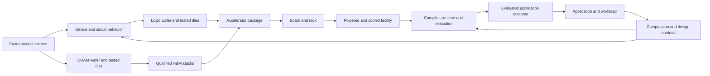

# AI Machinery Atlas: situation assessment and development roadmap

**7 September 2026 · Assessment and proposal; no product changes authorized by this document**

Assessed repository: [AI Machinery Atlas](https://github.com/SemiAIFoundry/ai-machinery-atlas), current source `227647a4ef22c73d3593936e93f7ecd7b109c770`, together with the [live atlas](https://semiaifoundry.com/ai-atlas/). The existing [comprehensive plan](PRIOR-EXPANSION-PLAN.md) remains the scope baseline. This roadmap is additive: it reconciles delivery against that plan and sequences the work needed to fulfill its learning promise.

## 1. Overall assessment

The atlas has established a substantial foundation: a broad, source-linked reference; a recognizable visual identity; an unusually wide connection between semiconductor manufacturing, computer architecture, AI infrastructure and model execution; and a useful library of numerical models. It is already valuable for orientation and guided exploration.

The platform's promise is more demanding. A learner should be able to explain how physical structures implement computation, how computation becomes useful AI behavior, and how changes at one level create constraints at another. That requires consistent mathematical meaning, faithful process representations, connected scenarios and evidence of understanding. Those capabilities exist in parts of the atlas, but they are not yet systematic.

**The recommended next advance is to make the atlas a platform of executable explanations: a learner changes a meaningful condition, sees the resulting state and mechanism, traces its consequences, and explains the outcome.** The existing breadth supplies the material for this work. More lesson inventory should be governed by the same explanation standard.

Three conclusions shape the roadmap:

1. Repair the scientific and navigation defects that undermine trust before expanding the curriculum further.
2. Build three complete experiences spanning physical foundations, manufacturing realization and AI execution. Use them to establish reusable content, visualization and assessment contracts.
3. Extend those proven contracts across the full scope, supported by specialist review and actual learner/device evidence.

The current static architecture can support this progression. A framework rewrite, account system or large backend is not required to begin.

## 2. What is actually built

These are source measurements, not claims of equal quality across every item. Detailed methods and file evidence are in the three supporting audits linked at the end.

| Asset or capability | Current evidence | Meaning and boundary |
|---|---:|---|
| Curriculum | 224 lessons, 62 chapters, 15 journeys | Broad coverage; taxonomy and teaching sequence need revision. |
| Historical context | 76 milestones | A useful chronology; integration with mechanisms and evidence needs deeper review. |
| Science content | 229 science cards | Formal rendering and semantic correctness are uneven. |
| Lesson references | 460 source links, 268 distinct URLs | Every lesson has sources. This does not establish claim-by-claim verification. |
| Explicit learning scaffolds | 180/224 lessons have objectives, examples and evidence notes | 44 original lessons lack these fields; field presence alone is not proof of instructional depth. |
| Prerequisites | All 97 original lessons lack prerequisite fields | The foundational route is less fully scaffolded than newer expansion material. |
| Explicit claim ledger | 39 claims; 122 source records; links to 34 distinct lessons | This measures structured claim coverage, not the number of sourced lessons. |
| Numerical learning | 24 labs; 31 numerical/process tests plus 4 portability tests pass | Meaningful reusable models exist; most lesson-to-lab connections are not contextual. |
| Knowledge checks | One three-option question per lesson | Helpful recognition checks; not evidence of transfer or retained understanding. |
| Delivery | Static deployment, stable lesson IDs, local assets and browser-local progress | A strong basis for portable, private, low-friction learning. |
| Performance measures | Existing entry JS: 1,891,202 raw bytes; 583,669 bytes with local gzip | File measurements, not measured production transfer size or user load time. |

TypeScript checking and the curriculum validator also pass. These checks establish useful software invariants, but they do not certify scientific validity, complete browser behavior, accessibility conformance or educational effectiveness.

### Maturity by purpose

| Purpose | Assessment | What would advance it |
|---|---|---|
| Orient a curious visitor | Strong foundation | Clearer entry routes and corrected taxonomy. |
| Serve as a technical reference | Substantial, uneven depth | Complete equation/specification contracts and reviewable provenance. |
| Explain a mechanism visually | Partial | Representations that respond to the actual process and variable being taught. |
| Teach engineering tradeoffs | Promising | Connect existing numerical models into coherent, saved scenarios. |
| Connect science to AI applications | Partial | Trace workload, data, execution and evaluated output through the same case. |
| Demonstrate learning | Not yet established | Prediction, explanation and transfer tasks observed with learners. |
| Sustain a current scientific resource | Early operational foundation | Source ownership, review triggers, schema validation and reproducible builds. |

These are assessment judgments, not numerical rankings or a certification.

## 3. Findings that should change priorities

### 3.1 Mathematical consistency is a correctness issue

The audit reproduced the current equation renderer across all 229 science cards. **199 render formally and 30 fall back to text.** Only the newest 14 lessons have an authored equation catalog, containing 19 formula entries; the original and expansion catalogs are empty. Much of the platform therefore depends on a heuristic text-to-LaTeX conversion.

Three confirmed conversions change meaning while still passing KaTeX: the intrinsic carrier-density formula, the contact transfer-length formula, and residual normalization. In the band-statistics example, `sqrt(N_C N_V)` is rendered with only `N_C` beneath the radical and a leftover parenthesis. The live browser reproduced this defect.

Correct these first, then review the full science corpus. Parse success is insufficient. Each formal equation needs a canonical source expression, symbol definitions, dimensions, assumptions, applicable regime, and a checked example where appropriate. A pedagogical relationship written as prose should remain prose; it should not be forced through an algebra converter. The existing accessible text alternative should be retained.

### 3.2 The newer content is stronger than some of its foundations

Manufacturing and memory additions often specify inputs, measurements, assumptions and qualification boundaries well. The hybrid-bond lesson, for example, carefully separates geometric pad overlap from bond yield and a research demonstration from product qualification.

However, 44 original lessons lack the explicit objective/example/evidence scaffolds now used elsewhere, and all 97 originals lack prerequisite fields. Gaps include logic-to-arithmetic concepts and model fundamentals such as tokenization, embeddings, normalization, optimization and post-training. Foundational science cannot become a thin introductory layer beneath increasingly detailed packaging content.

The description audit also confirmed **38/224 lessons with direct visual-authoring directions**. Some visible text tells a future author what the visualization “should” show. Rewrite these as explanations of what the learner can actually inspect, and track unimplemented visual intentions separately from the curriculum.

### 3.3 Visual reuse is obscuring process differences

The expansion contains 127 lessons using 19 chapter scene families. A structural geometry probe found 27 distinct anatomy signatures after ignoring semantic IDs. Reuse itself is sensible; the issue is whether the shared representation teaches the selected mechanism.

Under the current process-view mapping, **69/127 expansion lessons have identical visible geometry through all six steps**, and another 20 have only two geometric states. Eleven process-wafer lessons share a six-state copper damascene animation even when the lesson concerns a different operation. The probe compares geometry at time zero with other controls held constant; generic animation can still occur. Text, labels, camera movement and explanatory value are separate questions.

The live hybrid-bond route confirms the mismatch: the text moves from bonding-surface creation to planarization, while the visual retains a complete HBM stack without exposing the surfaces being transformed. Data, electrical and thermal overlays also reuse paths that are not derived from a corresponding transfer, circuit or heat model. Original scene models do not consume those overlay changes.

The remedy is a small set of scientifically distinct renderers with explicit state contracts. An ALD sequence, a CMP cross-section, a transistor transfer curve, a matrix operation and a coolant loop require different representations. Some should use 2D plots or cross-sections coordinated with 3D. Photorealism is useful only when it improves the explanation.

### 3.4 Navigation mixes physical scale with abstraction

Some architecture chapters are assigned to “Packaging & machines,” while physical data-center, operations, global and orbital chapters appear under “Executable software.” Source inspection establishes both assignments; the infrastructure placement was also confirmed in the live hierarchy. The six broad bands combine dimensions of organization that cannot form one clean ladder.

Keep the memorable atoms-to-intelligence journey, but support several coordinated maps: physical structure, manufacturing sequence, execution, prerequisites and evidence. A component may have a physical parent, a manufacturing predecessor and an execution role without those being the same relation.

The code declares six relationship types but generates only prerequisite and related edges from lesson records. Fixed connection diagrams provide useful orientation, yet do not constitute an authored engineering dependency graph. Typed, reviewable relationships would make cross-scale navigation and downstream reasoning much stronger.

### 3.5 The reference system is not yet a connected system model

A synthetic reference configuration already defines package, rack, hall and workload defaults. This is a valuable starting point. Its values do not yet consistently drive the scenes, labs and operating scenarios. Only the newest 14 lessons have an explicit contextual `labId`; other lessons generally open a default lab.

A learner cannot reliably change memory residency in one place and carry the resulting traffic, device count, power and service assumptions into the next task. Likewise, a selected process route does not consistently change interface geometry or downstream manufacturing output.

Build a shared scenario state around existing pure numerical functions. Keep the models modular and their regimes explicit. This should connect stated assumptions and consequences without pretending to be a universal semiconductor, facility or AI simulator.

### 3.6 The platform records exploration, not demonstrated understanding

Current progress saves visited lessons and the latest answer choice. Feedback reveals the correct option immediately, and the answer can be replaced. These behaviors are suitable for informal study, but the resulting count cannot establish mastery.

Add tasks where learners predict a change before seeing the result, inspect or calculate it, explain the mechanism, and apply it to an unfamiliar condition. Preserve first attempts separately from practice. Save the scenario and explanation as learner-owned work, with export/import before considering accounts.

Application coverage also needs to close the loop. The journey should reach an evaluated outcome—such as a correct answer, an acceptable inspection decision or a validated prediction—with latency, cost, energy and failure conditions attached. Tokens and FLOPS alone do not establish usefulness or intelligence.

### 3.7 Delivery foundations are good, but validation needs to mature

Phone activation of 3D, lazy scenes/labs, reduced-motion handling, render suspension, resource cleanup and WebGL recovery already exist. Preserve them. Current QA records do not establish physical iOS/Android behavior, constrained-network performance or full assistive-technology task completion.

The readable entry still imports much of the corpus and optional exploration content. Separate the compact navigation index and lesson reader from the map, comparisons and other destinations. First measure real devices; use the current ~584 kB local-gzip entry as a reproducible baseline, with an initial engineering target of ≤350 kB under the same method. This is a proposed budget, not a web standard.

Content validation must extend beyond counts and reference existence to full schemas, semantic mathematics, process reachability, scenario invariants and actual learner workflows. A build manifest should identify source/content/model versions so a shared lesson or reported problem is reproducible. Current live/source and fixed release snapshots should be identifiable without exposing internal release process in the learning interface.

## 4. The platform model to build toward

The central design principle is **one connected body of knowledge, viewed through different questions**:

| Map | Learner's question | Examples of relationships |
|---|---|---|
| Physical structure | What is it made of, and where is it? | Part of, contains, contacts, connected to. |
| Realization process | How is it designed, fabricated, assembled and qualified? | Requires, transforms, measures, assembles into. |
| Execution and resources | What work happens here, and what limits it? | Executes, stores, transfers, powers, cools, limited by. |
| Learning | What do I need to understand first, and what can I explain next? | Prerequisite, learning objective, worked example, transfer task. |
| Evidence and history | How do we know, and what changed? | Supports, demonstrates, supersedes, estimates, disputes. |

Do not make learners understand this data model before using the atlas. Present it as ordinary questions and linked views.

The original [Human Atlas reference](https://github.com/ashemag/human-atlas) illustrates the value of sourced, individually identifiable structures and coordinated anatomical navigation. For AI machinery, that principle extends to persistent component identity through fabrication and execution. It also requires plots, process states and computation traces because physical anatomy alone cannot explain those transitions. This is a design inference from the reference, not a claim of a comparative learning study.

This is a high-level relationship sketch, not a complete manufacturing flow. In particular, logic and memory originate in parallel wafer streams; HBM stack assembly precedes its integration into an accelerator package. Facilities enable execution while workload requirements also inform their design.

The educational depth should have three selectable levels using the same facts: an intuitive explanation, a dimensioned worked mechanism, and an engineering investigation. Each should preserve units, assumptions and evidence, with notation introduced progressively.

### Contract for a complete explanatory unit

Every upgraded unit should contain:

- A learner level, a prerequisite path and an observable learning outcome.
- A defined system boundary, named entities, units and a declared representation type: physical anatomy, conceptual diagram, measured trace, or model output.
- A mechanism with interpretable state. Controls must state what they change and what is held fixed.
- A numerical relationship where appropriate, with canonical mathematics, assumptions and a checked example.
- Evidence attached to the claims it supports, including the boundary between public product facts, representative designs, synthetic inputs and research results.
- A prediction and an explanation/transfer task, with a text or tabular equivalent for essential visual information.

The unit may share a scene or model with others. Acceptance depends on the selected mechanism being accurately represented, not on the number of unique meshes.

## 5. Three complete experiences to establish the standard

### A. One switching event becomes arithmetic

**Question:** How does controlled charge become a reliable numerical operation?

Trace material/band concepts → gate electrostatics and carrier transport → transistor behavior → CMOS inverter → logic and storage → an adder → multiply–accumulate. Coordinate real-space cross-sections with energy diagrams, voltage/current plots, truth tables, timing and bit values. Make the change in representation explicit at each boundary.

The learner should be able to change a voltage or load in a clearly bounded model, observe delay/energy consequences, follow an actual bit pattern through arithmetic, and explain why an ideal logic state still requires physical margins and time. Start with a representative mature device model or validated simplified model; do not infer a proprietary advanced-node process from generic geometry.

**Acceptance demonstration:** given a new input vector and a changed operating condition, the learner predicts the arithmetic result and explains an energy or timing tradeoff. Reviewers confirm the connection between mathematical model, circuit state and displayed behavior.

### B. Two wafer streams become a qualified accelerator

**Question:** Why does producing more silicon not automatically produce more usable AI capacity?

Follow a logic design and a memory design through their distinct fabrication and test paths. Retain die identity and test scope through thinning, stack assembly, package integration and qualification. Give TC-NCF, MR-MUF and hybrid-bond routes genuinely different interfaces and process states. Inspect one interface closely enough to see why local topography, alignment, material flow and thermal history matter.

Carry a single scenario through known-good inputs, HBM stack height, route capacity, compatible package inventory and deployable systems. Integrate existing yield, bonding, memory and capacity labs. Test placement and correlated failures must be explicit; do not convert geometric overlap or an unqualified yield product into product reliability.

**Acceptance demonstration:** the learner compares two feasible configurations, identifies the binding constraint on a common final-system basis, and explains why changing a route or test assumption changes accepted output. Every consequential parameter has a visible unit, source or synthetic label.

This is the recommended first integrated pilot because the newer content and numerical models are relatively mature. Experience A should be developed alongside its prerequisite foundations so the nano-scale promise advances as well.

### C. One AI request becomes an evaluated result

**Question:** What happens between an input and an AI response, and why do model and infrastructure choices affect the outcome?

Start with a small, inspectable model computation. Show tokens, embeddings, tensor dimensions, selected actual matrix values, attention, intermediate state and output probabilities. Connect a bounded operation to compiler decisions, kernel tiling, local memory, HBM, transfers and scheduling. Then move to a separate, clearly labeled larger-system resource scenario for prefill, decode or training.

Use the same workload specification across the resource path: model/state inventory → placement → bytes and operations → latency bounds or measured traces → package/rack energy → facility constraints → task evaluation. Distinguish measured execution, analytical ceilings and synthetic planning estimates. A toy model must not be presented as a disclosed frontier architecture.

**Acceptance demonstration:** the learner predicts how context, batch, precision or residency affects memory and service behavior; inspects the consequence; and explains a case where more compute does not improve an evaluated result. Include correctness, quality and failure analysis in the outcome.

[Transformer Explainer](https://poloclub.github.io/transformer-explainer/) is a useful precedent for connecting interactive inputs to actual intermediate computation. [OpenXLA's GPU architecture documentation](https://openxla.org/xla/gpu_architecture) provides a public example of the intermediate representations and compiler stages that can support the execution bridge. These are design references, not a recommendation to import an entire external application.

## 6. Scientific and technical depth to preserve and extend

The previous scope remains intact. The important change is the completion standard and order of delivery.

| Domain / prior commitment | Current assessment | Next depth investment |
|---|---|---|
| W01 Materials and starting wafers | Coverage present | Crystal defects, carrier statistics, interfaces and metrology connected to downstream outcomes. |
| W02 Repeated unit operations | Substantial text; visual mechanism mismatch | Distinct deposition, etch, implantation/anneal, lithography and CMP state models; show what is added, removed, changed or measured. |
| W03 Device and interconnect integration | Content and design bridge present | Persistent device identity through FEOL/MOL/BEOL, process–electrical consequences, RC and power delivery. |
| W04 Yield, test and process control | Useful numerical base | Variation, correlated defects, test coverage, repair/binning, traceable acceptance and reliability. |
| W05 Packaging and assembly | Broad route coverage | Real route-specific joints/interfaces, alignment, warpage, thermo-mechanics and qualification. |
| W06 HBM and emerging memory tiers | Stronger recent depth | Cell/bank/refresh/ECC → logical channels → physical stack; working-set residency and route constraints in one scenario. Keep HBF access, write and software assumptions explicit. |
| W07 Processing architectures | Families and specimens exist | Execute the same bounded operation on scalar/vector, SIMT and systolic examples; expose scheduling, locality, utilization and communication. |
| W08 Custom silicon and design | Expanded content plus CRG module | Reproducible workload→specification→RTL→implementation example, with verification, PDK/IP, timing, DFT, package and economics dependencies. |
| W09 Chip to hall | Components and labs exist | Coherent byte/current/coolant/heat paths, network topology, commissioning, failures and retained useful work. |
| W10 Global infrastructure and allocation | Dated snapshots and constraints exist | Capacity state transitions, scope/denominator discipline, time uncertainty, ownership and refresh workflow. |
| W11 Model–machine co-design | Many constituent topics exist | Actual tensor/kernel trace, explicit live-state lifetimes, distributed execution, data quality, post-training and application evaluation. |
| W12 Orbital/frontier infrastructure | Modules and budgets exist | Coupled workload, power, thermal, communication and reliability scenarios; explicit evidence/status and sensitivity. |
| Six additive connections | Partially represented | Fab tools/utilities, ramp states, co-design, custom-silicon economics, complete software/state path and lifetime useful work become case requirements. |
| CRG realization bridge | Dedicated material exists | Separate problem formulation, formal assumptions, method, reproducible artifact and measured validation; connect to conventional design flow and disclose what remains unresolved. |
| v1.2.0 delivery/depth commitments | Strong additions, incomplete whole-platform integration | Real-device task QA, memory-to-hall continuity, contextual labs and full equation review. |
| Film and navigation companion | Film retained as a distinct companion | Link chapters to complete experiences; refresh the walkthrough after the learning interaction stabilizes. |

The detailed curriculum audit provides lesson-level evidence. “Coverage present” does not certify every prior acceptance gate. The old implementation status file is an earlier snapshot; it should be reconciled into a current deliverable-and-evidence ledger before future release decisions.

### Areas that deserve more explicit treatment across these workstreams

**Fundamental science:** quantum/statistical descriptions, electrostatics, transport, circuit behavior and thermodynamics need coordinated representations with clearly stated regimes. Do not depict an energy band as a physical slab or a simulated carrier marker as an individual tracked quantum particle.

**Engineering realization:** engineering is a chain of constrained decisions, measurements and verification. Process windows, design rules, metrology, variation, test, thermal/mechanical margins and reliability should affect whether a design is accepted, not appear only as explanatory footnotes. [OpenROAD](https://openroad.readthedocs.io/en/latest/) offers a public route for a bounded RTL-to-physical-design teaching artifact. A mature public process example is appropriate; it cannot establish advanced-node or proprietary package readiness.

**Computational foundations:** make numerical representation, precision/error, linear algebra, probability, optimization, complexity and communication explicit prerequisites. Tie each to a concrete operation or consequence rather than introducing isolated textbook chapters.

**AI capability and applications:** strengthen data construction/quality, objective choice, training and post-training, generalization, retrieval/tool use, evaluation and failure analysis. Use at least two contrasting application constraints—for example, a retrieval assistant and a latency-constrained inspection task. A larger installed infrastructure base alone cannot demonstrate AGI; teach what a capability claim measures and what evidence would discriminate between explanations of progress.

**Economics and lifetime:** distinguish procurement, fabrication, qualification, commissioned capacity, scheduled use and retained useful work. Include repair/replacement, downtime, energy/water boundaries, supply dependence and uncertainty when they change an engineering decision.

**History:** link a breakthrough to the bottleneck it addressed, the mechanism it introduced, the evidence available at the time and the new constraint it exposed. Historical scaling fits and vendor-specific capacity claims must retain their metric, sample, date and denominator. Queue position, customer allocation and proprietary floorplans should remain undisclosed where public evidence does not establish them.

## 7. Phased roadmap and release gates

The sequence below defines dependencies and outcomes. It is not a calendar commitment; scientific review and learner testing need actual capacity assigned. Release numbering should follow the resulting user-visible scope rather than drive it.

| Phase | Deliverable | Exit gate |
|---|---|---|
| **0 — Establish a dependable reference baseline** | Correct corrupted mathematics; review all 229 cards; repair taxonomy; remove 38 confirmed authoring directions; complete missing foundational scaffolds; contextualize lab entry; reconcile completion status, assign review responsibility and record build identity. | No known semantic math errors or visible authoring instructions remain. Every lesson has a reviewed placement and prerequisite disposition. Formal expressions and prose relationships are classified; implemented controls accurately describe their behavior. Named review owners and source/content/build identification are in place. |
| **1 — Establish connected explanation contracts** | Validated lesson/entity/process/evidence/scenario schemas; typed graph; distinct scene/state registry; common scenario state; automated production-browser workflows; prototype experience B and foundational portion of A. | One meaningful input changes a computed state, an appropriate representation and a downstream consequence. Reviewer can trace result to inputs, equation and evidence. Save/share restores that scenario. Critical production-browser workflows pass before expansion. |
| **2 — Complete and validate the three experiences** | Finish A/B/C, contextual lab links, prediction/explanation/transfer tasks, text equivalents, learner-owned saved work. Include an evaluated application outcome. | Formative sessions record task outcomes, assistance and explanation/transfer rubric evidence; predefined critical comprehension/access blockers are resolved. All three complete with keyboard and assistive-technology checks and physical mobile-device review. This gate does not establish statistical learning efficacy. |
| **3 — Extend depth across the full scope** | Roll the proven contracts through W01–W12, CRG, foundational learning and application cases; expand route-specific process/architecture models; integrate history and evidence. | Each promoted domain meets the same scientific, causal and learning contract; no generic placeholder is presented as an implemented process simulation. Breadth remains navigable and loading budgets hold. |
| **4 — Establish sustainable learning and curation** | Review ownership, current-claim refresh queue, reproducible artifact pipelines, instructor packs, measured accessibility/performance and learning revisions. | A second contributor can add/review a unit without changing the monolithic app; a learner can reproduce/share work; dated claims and model revisions are maintained under assigned responsibility. |

Performance work, accessibility and browser testing begin in phase 0 and continue through every gate. Phase 4 operations should be designed early even though broader institutional features come later. Specialist research for future modules can run in parallel; publication should follow the validated template.

### Recommended first work packages

1. **Scientific repair and taxonomy:** one editor plus subject reviewers closes the concrete defects and assigns foundational prerequisites.
2. **Platform contracts and workflow tests:** one frontend/model engineer creates validated adapters, reproducible scenario state and critical browser workflows, retaining current IDs and math modules.
3. **HBM/manufacturing pilot:** a semiconductor reviewer and visualization engineer build the two-wafer/one-package path around existing labs.
4. **Physics/arithmetic pilot:** a device/circuit reviewer develops the switching-to-MAC example in parallel, with a learning designer checking transitions in representation.
5. **Execution/application pilot:** a compiler/ML reviewer joins once the state and visual contracts have proved usable; begin with a bounded computation and one evaluated task.

These are roles, not a requirement for five full-time hires. If only one implementation stream is available, finish the repair baseline and the HBM pilot before parallelizing full scene production. Review expertise is the main capacity to secure; increasing drafting speed will not resolve the scientific and pedagogical gaps identified here.

The accompanying backlog contains 30 dependent work packages. Relative effort is a planning comparison: S is a bounded correction, M spans several related components or review tasks, and L is a substantial scientific/interaction workstream. These are not person-day estimates. Decompose and estimate an L item after its representative model and reviewer are selected.

## 8. Technical and editorial implementation principles

Retain the static deployment and portable mode. Introduce validated adapters around existing content instead of replacing every record at once. Separate navigation, scenario state, lesson presentation and optional destinations from the main component as they are changed. Keep stable IDs and migrate saved work explicitly when check or model semantics change.

Use a scene registry keyed by the actual explanation/route, with declared supported controls. Renderers consume typed state; numerical functions do not depend on the camera or UI. An unsupported overlay should not imply a modeled physical flow. Keep reference configurations synthetic unless a named product disclosure supports the relevant value.

Connect entities, lessons, sources and claims through IDs. A claim needs scope, metric/basis, status, source locator and reviewer responsibility. A numerical model needs units, regime, provenance, checked cases and version. A scenario needs inputs, selected models, assumptions and outputs. Saved learner work needs the content/check version so future changes do not silently reinterpret a previous answer.

Store public reproducible artifacts where they add explanatory value: a small RTL/netlist/layout sequence, an inspectable tensor trace, or a measured kernel profile. Generate them offline and ship compact validated data first. Live third-party services or heavy simulation infrastructure should be introduced only when the learning task requires them.

Keep timeless mechanisms separate from dated product and capacity records. Review triggers should include a superseding source, incompatible specification, changed shipment/commissioning status or a model correction. An overdue review is an editorial signal, not evidence that a fact has changed. Current licensing and required third-party notices remain in place; this roadmap does not reopen that policy.

## 9. What success should mean

| Dimension | Proposed evidence |
|---|---|
| Scientific trust | Every formal expression reviewed for meaning; assumptions/units complete for promoted units; critical corrections tracked to affected lessons and models. |
| Causal explanation | Every interactive control in the three experiences changes its declared state; essential effects visible in plots/geometry/tables and explained by the same model. |
| Learning | First-attempt prediction, explanation rubric and unfamiliar transfer task recorded separately from visits and practice. Report sample size and task difficulty. |
| Navigation | Learners find a prerequisite, switch between structure/process/execution, and return to their case without assistance. |
| Access | Essential tasks complete with keyboard, a screen reader, zoom/reflow, reduced motion, failed WebGL, physical iOS Safari and Android Chrome. |
| Delivery | Repeatable device/network measurements; entry budget; no sustained hidden rendering; stable resources after repeated scene navigation. |
| Curation | Reviewed owner/status for all dated claims used in promoted experiences; reproducible source/model/build identity; link and schema checks. |
| Reuse | A second author produces one compliant unit; an instructor or learner exports and restores a scenario without an account. |

Begin with **6–9 formative sessions across curious beginners, technically trained learners and engineering/instructor users**. This is a proposed diagnostic sample, not a statistical efficacy study. Observe where users misread a representation, cannot state an assumption, or fail to transfer a result. Revise and repeat. Later evaluate retention and comparative learning outcomes with a study design appropriate to those claims. [PhET's research program](https://phet.colorado.edu/en/research) provides a useful precedent for iterative, observed simulation testing; its results are not evidence of this atlas's effectiveness.

Use [WCAG 2.2](https://www.w3.org/TR/WCAG22/) as the accessibility acceptance framework, including keyboard operation, 200% text resizing and reflow at 320 CSS pixels where applicable. An essential two-dimensional diagram may need its own pan/scroll treatment; the surrounding reading task should remain usable. Do not equate viewport emulation with conformance.

For field performance, aim for LCP ≤2.5 s, INP ≤200 ms and CLS ≤0.1 at the 75th percentile, segmented by device class, following [Core Web Vitals guidance](https://web.dev/articles/vitals). Where traffic is too low for representative field data, report controlled device tests and their conditions instead of inventing a percentile.

## 10. Boundaries and decisions

The atlas should retain its breadth and cinematic identity. The film can inspire interest and provide a guided arc, while the learning workspace supplies the mechanisms and investigations. A refreshed film or walkthrough should follow validated interactions so it accurately demonstrates what learners can do.

Defer a general chatbot, full LMS/account suite, VR mode, comprehensive live global tracker, and an attempted universal multi-physics simulator until a documented learning need justifies their cost. These may become useful later. They do not address the present defects or establish understanding by themselves.

The CRG contribution should be prominent as part of the computation-to-realization bridge. Its educational treatment should distinguish the historical problem, formal claim and assumptions, reproducible evidence, engineering interpretation and open questions. This strengthens its role within the full atlas rather than asking readers to accept a broad conclusion before inspecting the method.

The strongest path forward is therefore concrete: **make the current explanations dependable, connect them into complete cases, observe whether learners can reason with them, and use the resulting standard to deepen every domain already promised.**

## Evidence package and limits

- [Curriculum and science audit](CURRICULUM-AUDIT.md)
- [Visual and causal-learning audit](VISUAL-LEARNING-AUDIT.md)
- [Platform and delivery audit](PLATFORM-AUDIT.md)
- [Live-browser observations](LIVE-REVIEW.md)
- [Prioritized implementation backlog](ROADMAP.csv)
- [Equation diagnostic](equation-audit.json)
- [Reviewed authoring-direction inventory](storyboard-audit.json)

The audits combine full-corpus structural checks, equation-renderer reproduction, representative scientific review, a source-driven geometry probe, existing-build inspection and targeted live desktop navigation. They do not independently validate every scientific claim, rerun a clean production build, inspect every browser path, establish physical-device performance or measure learning gains. Product source, release and deployment were not changed during this assessment.
