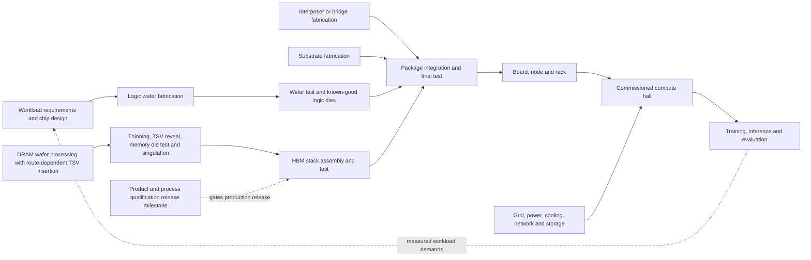

# AI Machinery Atlas — next-release development and integration plan

**Planning baseline:** 6 September 2026. **Owner:** Semi AI Foundry, LLC. **Status:** approved additive scope; implementation started 6 September 2026. All originally planned coverage remains in scope. The published release remains v1.0.0; choose the next release number when its compatibility and scope are settled.

Companions: [Evidence and primary sources](EVIDENCE.md) · [Prioritized work packages](backlog.csv) · [Baseline audit](baseline-audit.json)

## 1. The purpose of this release

Make the atlas a navigable explanation of how useful AI capacity is designed, manufactured, assembled, powered, connected, and used. A visitor should be able to move from a nanoscale operation to a system-level consequence and back again: why a surface must be planar, how that affects bonding, how bonding constrains package yield, how available packages constrain a hall, and why a model may still be limited by memory movement.

The release has three linked teaching goals:

1. **Explain the machinery:** constituents, mechanisms, dimensions, interfaces, and physical transformations.
2. **Explain the constraints:** yield, process windows, capacity, memory traffic, communication, energy, reliability, and utilization.
3. **Explain change over time:** dated breakthroughs, product generations, observed deployment, company announcements, and conditional future scenarios.

Breadth should emerge from connected depth. A longer list of product names or additional static chip models is not sufficient.

## 2. What the present atlas supports—and where it is thin

The source audit found 97 lessons, 26 branches in six navigation bands, five learning paths, seven numerical labs, 41 historical milestones, and 162 distinct source URLs. Existing lesson IDs, bookmarks, and device-local learning progress are valuable compatibility requirements.

| Area | Present coverage | Required expansion |
|---|---|---|
| Wafer fabrication | Three branch lessons: wafer hierarchy, lithography, CMP | A process graph spanning starting wafers, repeated unit operations, FEOL, MOL, BEOL, metrology, yield, test, and singulation |
| Device anatomy | Eight transistor records and selectable device geometries | Fabrication sequences that explain how those geometries are formed, inspected, and integrated |
| Packaging | Four lessons in the advanced-packaging branch | Distinct 2D/2.5D/3D flows, substrates, bridges, interposers, bonding, assembly equipment, testing, thermomechanics, and failure analysis |
| HBM | Stack and TSV lessons, linked to DRAM and controllers | DRAM fabrication, thinning/handling, TSV processing, stack assembly/test, base dies, PHY/controller, generation comparisons, silicon intensity, and supply constraints |
| Processing architectures | GPU-oriented compute branch; one host-CPU lesson | Architecture families, representative disclosed designs, programming models, specialization, and workload-dependent comparisons |
| Infrastructure | Rack, network, cooling and power components | Facility commissioning, grid connection, operating capacity, regional buildout, utilization, allocation, and workload delivery |
| Models and software | Transformer anatomy, distributed work, serving and scaling | Explicit workload resource traces connecting model choices to hardware and supply requirements |
| Current developments | Primarily sources attached to explanatory records | Structured dated claims, metric definitions, status histories, and a maintainable evidence layer |

The data already includes `branch` and `subbranch` fields, but the exported record type does not expose them. Related records are untyped ID lists; most numeric specifications are strings. Source links carry a title and URL, but not claim-specific support, effective dates, or structured measurement context. These are the main integration constraints to address first.

## 3. Organize the atlas as a connected hierarchy and process graph

Keep the six familiar navigation bands. Under them, support **domain → subsystem → component/process → mechanism → evidence**. Do not turn every process step into another top-level sidebar item. Add facets for physical scale, manufacturing stage, functional role, architecture family, and evidence status.

The user-facing journey can retain the memorable phrase **wafer → package → HBM → hall → model** as a set of places to visit. The underlying manufacturing explanation must show convergence: HBM is manufactured and assembled on its own path before integration into an accelerator package.

This is a dependency overview, not a universal factory recipe. TSV insertion and individual test steps depend on the chosen integration route; qualification is a product/process release milestone, distinct from screening each manufactured unit.

A physical containment tree answers **what is inside this?** A process graph answers **how is it made?** A dependency graph answers **what limits it?** A workload trace answers **what is doing useful work now?** These views should share entities and preserve selection when the user changes views.

## 4. Proposed curriculum workstreams

The inventory below is a scope map, not a requirement to create one shallow lesson for every noun. The planning envelope is roughly **80–120 new substantive lessons plus revision of 30–50 existing lessons**, producing around 180–220 lessons if the quality gates are met. Counts are estimates; do not publish a target count before the content audit. Expect approximately 45–60 navigable branches nested within the existing six bands.

| ID | Workstream and nested coverage | Viewer should be able to explain | Distinct visual treatment |
|---|---|---|---|
| W01 | **Materials and starting wafers:** electronic-grade silicon; crystal growth; orientation; slicing; polishing; epitaxy; contamination; wafer geometry and defect maps | How material quality and surface preparation become downstream yield and device constraints | Crystal-to-wafer transition, surface/topography view, traceable die sites |
| W02 | **Repeated fabrication operations:** oxidation; ALD/CVD/PVD; epitaxy; coating/baking/development; masks and OPC; DUV/EUV/high-NA concepts; plasma/wet etch; implantation/diffusion/anneal; cleans; CMP; inspection and metrology | What each operation adds, removes, changes, or measures—and why it is repeated | Scrubbable before/after cross-sections with material, tool interaction, and measured output |
| W03 | **Device and interconnect integration:** isolation/wells; planar/FinFET/GAA examples; gate-last flow; nanosheet release; source/drain; spacers; contacts and MOL; local/intermediate/global BEOL; vias/barriers/low-k; RC; backside power concepts | How unit operations produce a working transistor and its signal/power connections | Persistent device identity through a named reference flow, with branches for alternatives |
| W04 | **Yield, test and manufacturing control:** process windows; CD/overlay/roughness; wafer/field variation; systematic vs random defects; parametric test; scan/BIST; wafer probe; redundancy/binning; known-good die; dicing; traceability; cycle time | Why wafer starts, fabricated dies, good dies, and qualified packages are different quantities | Wafer maps linked to process/test stages, defect propagation and yield waterfall |
| W05 | **Package technologies and assembly:** flip-chip; RDL/fan-out; organic substrates/ABF; silicon interposers; localized bridges; CoWoS-S/R/L; SoIC; EMIB; Foveros; microbumps; thermo-compression; hybrid bonding; temporary bonding/debond; underfill/molding; warpage; TIM/lids; thermal cycling and qualification | How different integration choices solve interconnect problems while adding process and reliability constraints | True route-specific assembly sequences and comparable cross-sections; selectable joint/interface detail |
| W06 | **HBM from cell to delivered stack:** DRAM cell/bank; peripheral circuits; TSV and keep-out; thinning; alignment; stack height; assembly flows; base die; die/stack/package tests; channels/pseudochannels; PHY/controller; HBM generations; refresh/ECC; capacity/bandwidth/power; silicon intensity | Why high bandwidth costs wafer area, assembly effort, power, and qualification capacity | Follow one bit and one vertical connection; split physical stack from logical channel organization |
| W07 | **CPUs, GPUs and other processing families:** out-of-order CPU pipelines; scalar/vector units; cache coherence/NUMA; SIMT GPUs; scheduling/registers/scratchpads; tensor/systolic engines; NPUs; DSPs; FPGA fabrics; DPUs/IPUs; wafer-scale systems; selected analog/in-memory/photonic research | How execution model, memory organization, communication and software determine workload fit | Move the same small operation through genuinely different architectures; show idle work and data movement |
| W08 | **Custom silicon and the fabless ecosystem:** workload definition; architecture; IP/ISA; RTL; verification; synthesis/place-and-route; timing/power closure; DFT; PDKs; tapeout/masks; foundry; memory vendor; substrate supplier; OSAT; board/OEM/ODM; software enablement; qualification and deployment | Why designing a chip differs from manufacturing and productizing a useful computing platform | A design-to-deployment dependency map with named public case studies and dated status |
| W09 | **Chip-to-hall integration:** die-to-die links/UCIe; PCIe/CXL distinctions; accelerator scale-up; Ethernet/InfiniBand scale-out; optics and co-packaged optics; storage/checkpoints; rack power; cooling loops; facility heat rejection; substations/transformers; grid interconnection; commissioning; reliability | Why a delivered accelerator is not yet commissioned, productive capacity | Continuous package → board → rack → hall traversal; separate bytes, current, coolant and heat overlays |
| W10 | **Global data centers and AI factories:** regional/operator case studies; AI vs general-purpose facilities; operating/building/announced states; facility versus IT power; energy/PUE/water; grid availability; utilization; commissioning calendars; resource allocation | What a capacity announcement measures, when it becomes usable, and which constraint actually binds | Dated geographic and supply-network views with status filters and region/facility drill-down |
| W11 | **Model–machine co-design:** training vs prefill vs decode; weights/activations/optimizer/KV; quantization; sparsity and MoE; tiling/fusion; FlashAttention; parallelism; collectives; checkpoint/recovery; batching; disaggregated serving; context length; test-time compute; evaluation | Why more nominal FLOPS or more chips need not yield a proportional improvement in responses or capability | Trace one operation and its memory traffic from tensor through kernel to chip and network; paired bottleneck plots |
| W12 | **Orbital and other frontier infrastructure:** onboard edge inference; orbital compute demonstrations; proposed AI clusters; orbit/sunlight/eclipses; solar generation/storage; radiators; radiation/SEUs; optical links; ground stations; latency; launch/deployment/replacement; economics and lifecycle | Which workloads might benefit, what has actually been demonstrated, and what must be solved before scale | A physically constrained scenario view with energy, thermal, link and reliability budgets |

**Coverage priorities:** fabrication, package integration, HBM and the connecting system journey are the release’s center of gravity. The six pre-freeze amendments in section 16 add depth to these workstreams. They do not replace or reduce any previously planned coverage; lesson estimates may grow as needed. Orbital compute should be a bounded, technically serious frontier module. An extensive company catalog or world map must not displace the process science.

## 5. Architecture and ecosystem comparison standards

Build a common specimen card rather than a vendor leaderboard. A branded product is an example of an architecture, not a new architecture category. “XPU” is an umbrella label and needs a local definition.

Each specimen should record: family and workload; ISA/execution model; scheduling/dataflow; compute and memory organization; supported precision; dense versus structured-sparse peak; operation-count convention; clocks and power basis; memory capacity and usable bandwidth; chip/package/device/system boundary; scale-up/scale-out topology; software/compiler/runtime; launch/availability date; measured workload result and conditions when available; undisclosed fields; primary sources.

Representative cases should include public NVIDIA and AMD designs, Intel and Arm-based CPUs, Google TPU, AWS Trainium/Inferentia, Microsoft Maia, Meta MTIA, an FPGA, a DPU/IPU, and a wafer-scale system. Select generations for which meaningful architectural material exists; a recent product announcement can be a dated update card until deeper disclosures support a full lesson. Include custom-chip design/service and manufacturing partners as separate roles, with sources for relationships.

Compare the same workload, precision, batch/context, software configuration, system size, and measurement scope. Show missing values explicitly. Do not mix per-package peak compute with per-rack bandwidth, dense with sparse figures, or theoretical tops with measured throughput. Distinguish publicly announced plans, qualified silicon, availability, and deployed use.

## 6. What counts as a deep lesson

Every substantial lesson needs a coherent learning objective and the following appropriate elements:

- **Mechanism:** a causal explanation with a visual sequence; prerequisite concepts linked inline.
- **Anatomy or process state:** constituents, materials, interfaces, inputs and outputs; a scale indication and an explanation when dimensions are exaggerated.
- **Science:** relevant equations, variable definitions, units, operating regimes, assumptions and failure of the approximation.
- **Engineering:** parameters that matter, measurement methods, process windows or tradeoffs, and one contextual worked example.
- **Connections:** upstream requirements, downstream consequences, alternatives and bottlenecks.
- **Evidence:** claim-level sources, publication/effective dates, product configuration, and what remains unknown.
- **Practice:** a useful action or calculation, plus a question that tests understanding rather than memorization.

Offer progressive depth: an approachable explanation first; an engineering view with equations and tradeoffs; then source notes and detailed evidence. Do not bury the entry path under advanced process terminology. Conversely, an equation without units or a source list without supported claims does not satisfy the engineering layer.

For fabrication, make the process state explicit: after-develop resist geometry, after-etch transferred geometry and final electrical behavior are different measurements. For CMP, distinguish removal, uniformity, dishing/erosion and defectivity. For packaging, separate incoming die/substrate problems, interconnect formation, assembly damage and stress-driven failure. Teaching process windows and simulated defect maps must be marked as examples, not proprietary recipes or qualified production limits.

## 7. 3D interactions that teach the science

1. **Process playback:** scrub a named fabrication or assembly sequence. The same object persists while material is deposited, patterned, removed, planarized, tested or joined. Explain which representative integration route is shown.
2. **Coupled cross-sections:** selecting a wafer feature opens its device cross-section; selecting a bond opens interfacial structure and the associated electrical/thermal role. A visible selection and breadcrumb connect scales.
3. **Alternative integration routes:** compare full interposers, RDL arrangements and embedded bridges with the same endpoints and workload assumptions. Different technologies need different geometry and process order.
4. **Flow overlays:** select charge/current, tensor bytes, heat, coolant, optical traffic, or production material. Each overlay has units and a legend; they do not share an unexplained particle effect.
5. **Constraint propagation:** change die area, memory requirement, bonding yield, package throughput or available IT power. Highlight the affected downstream stage and explain the limiting resource.
6. **Failure and inspection:** reveal a simulated defect, see its possible consequences and choose an informative inspection. Multiple mechanisms can produce the same symptom; the display must not pretend a visual pattern proves causality.
7. **Semantic zoom:** use continuous, bounded camera movement between representative scales, with explicit transitions between physical geometry, energy diagrams and software abstractions. Avoid claiming one literal, dimensionally faithful scene spans a transistor and a data center.
8. **Accessible equivalents:** every selectable mesh and process step has a keyboard/list equivalent; animation can pause; simplified geometry, reduced motion and text/2D views retain the learning task.

## 8. Quantitative labs and models

Extend the existing labs where practical. The following are candidates, with the first six prioritized for the hardware-focused core. Every lab has defined inputs, dimensions, assumptions, bounds, source/default provenance, and an interpretable result.

| Lab | Inputs and outputs | Main lesson and limit |
|---|---|---|
| L01 Wafer-to-good-die yield | Wafer/die area, edge exclusion, defect density, clustering option → gross/good dies | Separate geometrical yield, process yield and test/binning; compare simplified random-defect models |
| L02 Patterning process window | Wavelength/NA and model factor; focus/exposure sliders; CD/overlay targets → feasible region | Resolution and depth-of-focus tradeoffs; derived toy window is not a real process recipe |
| L03 CMP/topography and bonding readiness | Starting topography, relative removal/selectivity, variation → remaining film/dishing/planarity indicators | Why averaging hides local failure; explicitly illustrative coefficients |
| L04 Assembly yield and test placement | Incoming known-good parts, per-stage yields and test costs → finished units and losses by stage | Show selection/rework assumptions; do not blindly multiply raw die yield through a stack of screened dies |
| L05 HBM silicon intensity and allocation | Target bits and either geometric area-per-bit plus explicit yields, or an empirical wafer-supply-per-output-bit ratio → normalized wafer demand | Keep the two estimation methods separate; an additional yield penalty is valid only when the starting ratio excludes that loss. Distinguish footprint, stack height and package capacity. |
| L06 End-to-end capacity | Good logic dies, HBM stacks, interposers/substrates, package throughput, qualification and powered racks → deployable units | Convert everything to a compatible final-system basis before identifying the bottleneck |
| L07 Architecture/dataflow | Same matrix/tensor task on scalar/vector, SIMT and systolic examples → operations, traffic and utilization | Execution/dataflow comparisons rather than an unsupported cross-vendor benchmark |
| L08 Memory wall and roofline | Peak compute, bandwidth, arithmetic intensity and precision → attainable performance ceiling | Plot memory capacity separately; theoretical upper bound is not measured throughput |
| L09 Model footprint and serving | Weights, activations, optimizer/KV settings, batch/context, parallelism → memory budget and traffic | Distinguish prefill/decode/training and named model simplifications |
| L10 Collective communication | Payload, topology, ranks, bandwidth and latency → communication lower bound and overlap scenarios | Account for topology and contention assumptions; show scale-up vs scale-out boundaries |
| L11 Hall energy, cooling and useful work | Facility or IT power, PUE, deployment configuration, utilization, runtime profile → energy and constrained work rate | No universal MW-to-tokens conversion; use a disclosed benchmark/configuration or clearly synthetic scenario |
| L12 Orbital feasibility | Solar exposure, conversion/storage assumptions, power load, emissivity/temperature/view factors, link rates and duty cycle → energy/thermal/link budgets | Heat rejection, radiation, data movement and replacement are explicit constraints, not free benefits of space |

The capacity lab should use a transparent simplified relationship such as:

`good packages / month ≈ final assembly yield × min(good logic dies / logic dies per package, good HBM stacks / stacks per package, ready interposers, ready substrates, assembly throughput)`.

All terms inside the minimum must represent packages per month. A multiple-logic-die design needs separate constraints for each die type. A bounded time-dependent mode is required: use synthetic stage delays, inventories, a capacity ramp and qualification/readiness gates. A static minimum does not predict a real delivery date; detailed fab dispatching and customer-specific scheduling remain outside this release. Report assumptions about correlated failures, rework and inventory explicitly.

For orbital thermal teaching, start from net radiative heat balance, then add absorbed sunlight/Earth radiation and view factors. A simple radiator-area estimate is a bound for a specified temperature/emissivity/environment, not proof that a proposed installation is feasible.

## 9. Learning journeys and the first integrated slice

Retain the current five paths and deepen them. Add or substantially rework these journeys:

- **Two wafers to one AI system:** logic and memory production converge at packaging, then proceed through test, board/rack assembly and workload execution.
- **Follow one byte:** DRAM cell → HBM channel/controller → cache/scratchpad → arithmetic → network collective.
- **Follow one watt:** grid → conversion/distribution → switching → package → coolant → final heat rejection; compare an orbital thermal path separately.
- **Follow one manufacturing order:** design qualification → capacity reservation assumptions → process bottlenecks → assembly → commissioning. Actual customer schedules remain unknown unless disclosed.
- **Why the accelerator is waiting:** compare memory, network, CPU/input pipeline, scheduling and power constraints under a fixed workload.
- **Choose an architecture:** map a task’s parallelism, precision, memory and latency needs to architecture options.
- **From a model to a hall:** trace model/software choices into memory, interconnect, power and system requirements.
- **Could this workload run in orbit?** compare onboard inference, independent batch jobs and tightly coupled training with explicit constraints.

**First implementation slice:** complete a small set of roughly 12–16 linked lessons across logic-wafer processing, memory/TSV/stack construction, a representative package, a compute rack, a hall and prefill/decode. Include one scrubbable physical process, one integration comparison, a claim-linked HBM metric, a short model-to-executable trace reusing existing software lessons, and the end-to-end capacity lab. The specific 3× wafer-supply card is gated on source recovery; the HBM teaching sequence can proceed independently. This is the test of the new platform architecture before expanding the full curriculum.

The slice passes only if a learner can explain both why the production paths converge and why changing one upstream or downstream constraint can change useful system throughput. A selected object, source citation, lab assumption and path position should stay connected as the viewer changes scale.

## 10. Current topics and the evidence model

Keep durable science and time-sensitive reporting connected but separately maintained. Each current-topic card should answer: what is asserted, who asserted it, what metric and population it covers, when it applied, and whether it describes an observation, forecast, announcement or illustrative scenario.

Priority evidence questions for the release:

| Topic | Required framing |
|---|---|
| TSMC queue and capacity allocation | Separate foundry node capacity, packaging technology, product qualification and commercial allocation. Use dated public statements; do not fabricate a FIFO queue, customer position, allocation shares or delivery lead times. |
| CoWoS and EMIB | Explain technical differences and each process’s bottlenecks. An announcement of capacity or customer interest is not evidence of identical shortage conditions or interchangeable manufacturing capacity. |
| HBM using 3× silicon | Specify the named HBM/DDR generation, equal delivered-bit basis and process-node context of the source. Do not relabel this as stack height, package footprint or a universal DRAM rule. |
| Compute 3× versus memory 2× per two years | Treat the cited historical plots as separate metric/sample analyses. Keep capacity, bandwidth and latency distinct; label fit periods and precision/normalization changes. |
| Custom-chip growth | Use a dated portfolio of disclosed products and deployments. Design announcements, tapeouts, qualification, cloud availability and volume shipments are distinct states. |
| Global data-center/AI-factory expansion | Preserve geography, forecast scenario, publication date and power/energy boundary. Separate all data centers from AI-focused facilities; do not add overlapping site, campus, company and regional totals. |
| Orbital compute | Label demonstrated operation, announced mission, research proposal and speculative scenario separately. Distinguish onboard inference from an operational, tightly connected training cluster. |
| More compute and model progress | Separate installed hardware, utilized compute, training/inference expenditure and measured capability. Algorithm/data/evaluation changes matter; infrastructure expansion alone does not establish AGI. |

**Claim schema:** stable ID; concise assertion; entity/product and configuration; metric name, numeric value/range, unit and denominator; geography/population; period; source organization/title/URL/date plus page/figure/table or quoted locator; evidence type; method and assumptions; observed/forecast/announced status; effective date; checked-on date; reviewer; supersedes link; review-by date; conflicts and uncertainty notes. A source URL alone cannot fulfill this schema.

Use review triggers by data type: capacity/product/deployment cards at each release and on a relevant new primary disclosure; engineering background on a slower editorial cycle. Show the date beside the claim. Flag stale items for editorial review; do not silently treat a missed refresh as a new fact. An automatic link checker can identify broken URLs, but a human or source-reviewed process must assess whether a claim remains supported. No recurring monitoring is being scheduled by this plan.

Historical progress should form linked lineages: transistor structures and electrostatics; patterning and metrology; contacts/interconnect/CMP; packaging and HBM; processor execution/dataflow; and software/model efficiency. Each event identifies the barrier addressed, the enabling mechanism, the new tradeoff, and whether its date denotes a paper, demonstration or production adoption. Connect milestones directly to process steps, specimens and labs.

## 11. Integration into the existing codebase

A static React/Vite deployment remains sufficient for a curated educational release. Plan for modular content and progressive loading before considering a backend.

| Existing surface | Planned evolution |
|---|---|
| `src/lib/data/records.json` | Migrate through a compatibility adapter into typed lessons, entities, process steps, specimens, claims and sources; retain existing IDs and redirects |
| `src/lib/atlas.ts` | Replace hard-coded depth assumptions with hierarchical navigation, typed relationships and path definitions; expose branch/subbranch consistently |
| `src/lib/scene-models.ts` | Split into lazy-loaded scene families and shared geometry/material helpers; register authored representative models separately from product facts |
| `src/components/atlas-scene.tsx` | Process playback, cross-section state, linked selection and overlays; preserve the verified nonnegative animation clock and proper GPU-resource disposal |
| `src/components/lab.tsx` and `src/lib/lab-math.ts` | Separate dimensioned numerical models from UI; add scenario presets and provenance for inputs |
| `src/Atlas.tsx` | Hierarchical drill-down, breadcrumbs, related-view switching, architecture comparisons and dated evidence cards while retaining Learn/Science/Specs/Connections |
| Existing validation scripts | Add schema/reference/unit checks, process reachability, navigation migration and meaningful numerical invariants; browser verification for critical learning tasks |
| Static assets and hosting | Route-split large assets, use instancing/LOD where useful, retain local fonts/scripts, preserve subdirectory hosting and established route-specific policies |

Candidate entities: physical part, material, process operation, architecture, product specimen, organization/role, facility, software operation, workload, metric, source, claim, historical event. Candidate edge types: part-of, produced-by, input-to, assembled-into, tested-by, communicates-with, powered-by, cooled-by, executes, limited-by, alternative-to, and supersedes. Keep physical containment, chronology, causality and commercial dependency distinct.

Use a versioned URL/state contract so existing `#gpu-die`, `#hbm-stack`, `#cdu` and other fragments continue to work. Add process position, comparison and path state without losing the original deep links. Migrate saved progress explicitly if IDs must change; the preferred approach is preserving IDs and linking deeper children beneath them.

## 12. Delivery sequence and review gates

| Phase | Deliverables | Exit gate |
|---|---|---|
| P0 — Scope and evidence contract | Approved taxonomy/gap map, claim ledger, source rules, initial process references, prioritized backlog | Agree the representative flows and comparison boundaries; identify unknowns rather than fill them with guesses |
| P1 — Complete cross-scale slice | New schema adapter, linked scene/process UI, 12–16 complete lessons, capacity lab | A learner can follow both wafer streams through a system and explain an actual modeled bottleneck |
| P2 — Fabrication, packaging and HBM depth | W01–W06, step-by-step sequences, yield/test/assembly labs, historical milestones | Semiconductor review verifies process order, mechanisms, units, measurements, assumptions and product-specific distinctions |
| P3 — Architectures and custom silicon | W07–W08, specimen comparisons, software paths, design-to-deployment journey | Comparisons are workload- and metric-consistent; missing disclosures remain explicit |
| P4 — Hall, allocation and model co-design | W09–W11, current-topic cards, regional cases, end-to-end workload/resource traces | Capacity accounting avoids double counting; source dates and measured/forecast states are visible |
| P5 — Orbital frontier module | W12 core lessons, status chronology, representative mission/proposal cards, budget explanations and the full coupled feasibility lab | Thermal, energy, communication and reliability limitations accompany every scenario |
| P6 — Integration and release | Whole-atlas navigation/learning QA, accessibility/performance checks, refreshed source ledger, release notes, updated walkthrough and optional film chapter | All planned evidence, learning, map and lab gates pass before assigning and publishing the release |

Research and content drafting can progress in parallel, but shared schemas and the complete slice must stabilize before mass content import. Within fabrication, visual authoring follows an approved process sequence. Do not parallelize contradictory edits to the same product facts or unit definitions.

Effort is dominated by source review, scientific scene authoring and learning QA—not by adding record rows. Use small/medium/large work-package estimates after the slice; a credible calendar requires a known reviewer/engineering cadence. Do not promise a release date from the preliminary lesson count.

Deliver in the agreed stages while retaining all planned vendor, regional, global-map, orbital and numerical-lab coverage. Additions are cumulative. Further scope reductions require an explicit user change of direction; implementation staging does not remove deliverables.

## 13. Acceptance criteria

- Every legacy lesson/deep link remains reachable; a sample of existing saved learning progress survives migration.
- Every new lesson has a stated outcome, prerequisite path and meaningful depth; reused schematic geometry is justified by shared structure.
- Process visuals preserve a named sequence and distinguish alternatives. Each step identifies input state, transformation, output, measurement and downstream significance.
- Each quantitative claim has units, denominator, configuration, date and direct primary support; estimates and forecasts are visually distinguishable from observations.
- All equations and calculations have bounds/assumptions; numerical tests exercise invariants and failure cases rather than mirror implementation.
- Architecture comparisons use compatible metrics and openly display unknown values.
- Capacity models reconcile component units and time bases, account for yield/test scope and avoid facility/region double counting.
- The orbital module differentiates demonstrated workloads, announced missions and research proposals; it includes coupled thermal/energy/link constraints.
- Keyboard, screen-reader text alternatives, reduced motion, mobile layouts and constrained graphics paths support the actual learning tasks.
- Test direct links, process scrubbing, rapid scene switching, repeated navigation, search, comparisons, labs and restoration on a served production build. Track errors and retained GPU resources across repeated use.
- Measure an explicit performance baseline on agreed desktop/mobile devices, including cold/warm loads, memory, interaction latency and representative scene complexity; set budgets from that baseline.
- Original visuals/content preserve MIT attribution to Semi AI Foundry, LLC; external figures, product materials, software, fonts and sources retain their own terms and notices.
- The final release has a fixed tag, reproducible source/static archives, checksums, citation metadata, separate software/content changes, and documented validation scope. Release numbering is decided then, not changed for this planning draft.

## 14. Immediate next work after plan review

Start with the ontology and claim schema, a detailed two-stream manufacturing storyboard, and the first set of source-backed slice lessons. Review those together before committing to a much larger content inventory. Use the slice to settle the visual language, numerical assumptions and navigation, then expand the prioritized work packages in `backlog.csv`.

The companion evidence notes and source ledger form a research starting point, not a finished scientific review of every future lesson.

## 15. Evidence checks that shape this proposal

The capacity lesson has a current primary anchor: TSMC management described packaging capacity as limiting customer growth in its **16 July 2026** call. That supports a dated constraint narrative, while customer queue positions and detailed allocations remain undisclosed. [TSMC transcript, p.10](https://investor.tsmc.com/english/encrypt/files/encrypt_file/reports/2026-08/3e494f0c14dd0890f897aa044415e21d93486cc4/TSMC%202Q26%20Transcript.pdf).

The memory-growth chart needs separate panels. The 2024 memory-wall paper reports historical fitted compute, DRAM-bandwidth and interconnect-bandwidth trends in one figure and single-GPU memory capacity in another. Preserve metric, sample and period in the visual rather than extending one headline ratio into a forecast. [Gholami et al.](https://arxiv.org/html/2403.14123v1).

For global infrastructure, start from the **April 2026 IEA update**, with a 2025 estimate and 2030 projection; maintain the AI-focused subset separately. Regional studies have different scopes and should be compared on those terms. [IEA](https://www.iea.org/reports/key-questions-on-energy-and-ai/executive-summary).

For orbit, couple the proposed infrastructure to spacecraft thermal engineering and explicit communications requirements. Suncatcher’s revised design study is a proposal/research source; NASA’s thermal guidance provides a grounded mechanism reference. [Suncatcher v2](https://arxiv.org/html/2511.19468v2), [NASA thermal control](https://www.nasa.gov/smallsat-institute/sst-soa/thermal-control/).

The HBM 3× silicon comparison has a clearly identified denominator in indexed Micron primary material, but its original attachment needs migration verification before it becomes a published numeric card. This is an explicit evidence task in the backlog, not a gap to fill with a generic multiplier. Full qualifications and source packets are in [EVIDENCE.md](EVIDENCE.md).

## 16. Pre-freeze gap review and amendments

**Review date: 6 September 2026.** The gaps below strengthen the existing 12 workstreams. They use the existing top-level bands and may increase lesson counts. Reuse and deepen existing SRAM, DDR/LPDDR, storage, compiler, runtime and management-controller lessons while preserving all previously planned vendor examples. The user approved these as cumulative additions on 6 September 2026; implementation is authorized.

### Six connections to make explicit

1. **Inside the fabrication plant (W01–W04; B10/B12).** Add a bounded tool → wafer handling → facility-utilities branch. Inspect one representative process tool deeply, linking its chamber, vacuum, material delivery, energy source and controls to the wafer transformation. Connect cleanroom contamination control, ultrapure water, gas/chemical supply, abatement, maintenance and wafer transport. Map equipment/material supplier roles without creating a vendor directory. Separate this manufacturing plant from the data center that later uses its output. TSMC’s public description of MES, process control and automated handling supplies an initial automation reference; utility and tool details still need route-specific sources. [TSMC intelligent packaging fab](https://www.tsmc.com/english/dedicatedFoundry/services/apm_intelligent_packaging_fab).

2. **Capacity through time (W04/W10; B08/B20).** Teach ordered equipment → installed equipment → process-qualified capacity → product-qualified capacity → actual good output, with commercial allocation represented separately. Extend L06 with a small synthetic ramp/inventory/delay scenario. Explain repeated tool visits, shared equipment, maintenance, yield ramp and why capacity compatible with one product may not serve another. The viewer must distinguish processing time, waiting time and delivery readiness. This is a bounded teaching simulation, with no implied visibility into a manufacturer’s actual dispatching or customer queue.

3. **Design–process–package co-design (W03/W05/W08/W09; B13/B17/B18).** Connect functional partitioning and process-node choice to reticle/package limits, pad/bump/TSV layout, routing, test access, signal integrity, power-delivery impedance/voltage drop, heat and mechanical stress. Use one constrained package comparison with identical functional requirements; an attractive assembly geometry must still pass its interface and physical budgets. Explain the layers of compatibility rather than assuming an interface label establishes a drop-in chiplet ecosystem. Annotate node names separately from actual dimensions. Initial references: [imec system/technology co-optimization](https://www.imec-int.com/en/expertise/cmos-advanced/compute/cmos-scaling), [IBM chiplet signal/power integrity study](https://research.ibm.com/publications/signal-and-power-integrity-design-and-analysis-for-bunch-of-wires-bow-interface-for-chiplet-integration-on-advanced-packaging).

4. **The economics behind custom silicon (W08/W10; B17/B20).** Add a worked make/buy and monolithic/chiplet comparison with explicit development/NRE, masks, yield, packaging/test, software effort, deployment delay, production volume and operating assumptions. Show cost per good package and cost per specified useful workload as different outputs. Use synthetic ranges and sensitivity rather than undisclosed contract prices. This extends existing yield/capacity exercises; a full financial simulator is outside scope. [Chiplet Actuary](https://arxiv.org/abs/2203.12268) supplies a research starting point, not current market pricing.

5. **The complete execution and memory path (W06/W07/W11; B15/B19).** Follow a small tensor operation through graph representation, compiler transformations, generated kernels, runtime/driver coordination, execution units and memory traffic. Label the chosen stack as a representative route. Relate registers/SRAM/cache, HBM, DDR/LPDDR, GDDR where relevant, and persistent storage by role, capacity, bandwidth, latency and energy; CXL is an interconnect/protocol context, not another memory-cell type. Connect data loading/preprocessing and checkpoint I/O so the trace includes its inputs and outputs. Reuse existing compiler/runtime and memory records. OpenXLA provides a concrete public path from framework operations through compilation and runtime execution. [OpenXLA GPU architecture](https://openxla.org/xla/gpu_architecture).

6. **Delivered work over the operating lifetime (W09–W12; B18/B19/B22/B23).** Carry a minimum reliability thread from initial yield/qualification through in-service errors, detection, throttling, recovery, replacement and retirement. Add one synthetic interruption/checkpoint scenario to useful-work accounting; distinguish time executing, work successfully retained, latency/quality targets and energy spent. Do not assume independent component failures or multiply generic availability ratios into a universal cluster result. Reuse terrestrial concepts in the orbital comparison. Detailed aging models and full lifecycle inventories remain later depth. [Google’s checkpointing/goodput discussion](https://cloud.google.com/blog/products/ai-machine-learning/elastic-training-and-optimized-checkpointing-improve-ml-goodput) is a provider-specific mechanism example, not a universal benchmark.

### Implementation decisions to lock at the slice gate

- **Learning contract:** beginner entry plus optional engineering depth, inline glossary/acronyms, prerequisite links and explicit unit help. Test whether learners can predict the result of a changed constraint, explain it, and transfer the explanation to an unfamiliar example. A recorded click-through is not learning evidence. Use a small documented formative review across intended skill levels; do not claim population-level educational effectiveness from it.
- **Coherent reference system:** one consistent illustrative bill of materials and workload profile drives the first package/rack/hall/capacity scenes. Record all die/stack counts, memory totals, interface and power boundaries centrally. Separately label product specimens; never blend generations into a supposedly real SKU. Publicly unrecoverable details remain schematic or unknown.
- **Visual contract:** distinguish sourced product anatomy, representative process geometry, physical simulation and illustrative animation. Set scale/units, material and flow legends, exaggerations, abstraction transitions and text alternatives in the storyboard. Scientific review is of the actual sequence and claims, not just the rendered appearance.
- **Content operations:** assign an author/reviewer role to each work package, add lesson/claim change history and a short contribution template, and record source locators plus permission/attribution metadata. Content corrections and new evidence can be maintained independently from code releases. Avoid duplicate entities and circular prerequisite chains.
- **Scope gate:** all 12 workstreams and six amendments are required, including the global map/dataset (B21) and full orbital scenario lab (B24). Every original lesson family, lab, learning journey and historical lineage remains planned. The film chapter retains its original optional status; the walkthrough refresh remains required.
- **Evidence gate:** resolving the Micron attachment remains a required research task (B04), but it gates the specific numerical card/default rather than the entire HBM branch. The release review must resolve, qualify or withhold every unsupported quantitative assertion.

The curriculum boundaries, data/visual contracts, first-slice acceptance criteria and delivery gates are approved for implementation with these additive amendments. Keep current-event values, exact vendor generations and final lesson counts editable through the documented evidence/content process. P0 may settle route-specific authoring details without reopening the whole scope.

## 18. Additive CRG computation-to-realization module

The chip-design layer now includes a dedicated **Communication Theory of Computation Realization (CRG)** module supplied by Semi AI Foundry. CRG is represented as a source-labeled research framework that carries one computation through seven explicit boundaries: intent, representation, architecture, chip design, physical build, system operation, and verification evidence. This strengthens W07–W11 and the existing design-to-deployment journey without replacing any architecture, fabrication, package, infrastructure, model or historical coverage.

The CRG addition has three requirements:

1. Show chip design as a traceable transformation from workload/tensor intent through microarchitecture, RTL, PDK-constrained physical design, tapeout, wafer test, package integration and operating workload.
2. Treat communication as a first-class physical resource. Every important edge carries a declared payload/encoding, rate, latency, energy, error condition and receiver boundary where those fields are known.
3. Present the “approximately 55-year” realization statement as a **Semi AI Foundry research claim** with direct provenance and explicit scope. It must remain separate from independently sourced historical milestones and from proof of AGI, universal chip realization or proprietary implementation details.

The release includes a CRG process route, an interactive seven-boundary bridge, six deep lessons, a typed relationship path, formal equations, and a verification loop connecting simulation, signoff, silicon, package, system and workload evidence. Counterexamples, corrections and future evidence remain valid additions under the same content/evidence contract.

## 17. Additive implementation authorization

On 6 September 2026, the user explicitly instructed: “don't take out any part of the previous plan; this is additive to what was already outlined and planned for.” This instruction supersedes earlier scope-trimming and optional-expansion language. All 97 existing lessons, 26 original branches, seven original labs, five original paths and 41 historical milestones are retained. The full original release plan plus section 16 additions will be implemented and verified; stage completion will be recorded honestly in IMPLEMENTATION.md. The existing v1.0.0 release/tag remains intact while development proceeds.

## 19. Approved v1.2.0 implementation addendum — 6 September 2026

This addendum is additive. All earlier workstreams and original scope remain.
The delivered v1.1.1 baseline contains 210 lessons, 57 branches, 14 paths,
21 labs and 73 milestones. The user approved this next implementation and
clarified that commercial restrictions must cover the software itself as well
as the curation. The user also explicitly authorized deletion of earlier public
release pages and downloadable assets. Do not rewrite source history or imply
that deletion retroactively removes a previously granted license.

### Device-adaptive delivery

Phone reading-first layout with explicit model activation, accessible contents
and all destinations, useful tablet panes, lesson focus/scroll behavior, touch
targets, local equation/table containment, adaptive process/comparison views,
and suspend/on-demand rendering. Preserve desktop, stable IDs and saved progress.
Test 320–430px phones, 768–1024px tablets and desktop; check portrait/landscape,
200% text, a complete learning journey, and modal/3D scrolling. Report emulation
separately from real-device, network and battery measurements.

### Infrastructure depth and connected labs

Add a focused sequence for HBM stack-height budgets, thermal/yield behavior,
TCB/TC-NCF, MR-MUF, hybrid bonding, route selection, HBF read-tier contracts,
latency/prefetch, working-set placement, training, prefill/decode, MoE and
memory-to-hall qualification. Cite primary sources and distinguish announced
specifications from shipping and measured systems. Wire three numerical labs:
HBM stack construction, inference memory placement, and token-path critical
path/energy. Keep model assumptions and units visible and test numerical edges.

### Commercial-use boundary

Apply a CRG-style Research and Noncommercial License (PolyForm base plus
attribution and clear scope conditions) to atlas-owned code and original
content. Academic/public-interest research, teaching, personal and hobby use
remain permitted. Commercial exploitation requires a separate written license
from Semi AI Foundry, LLC. Preserve third-party terms, maintain contributor
rights for future submissions, and synchronize all public notices, metadata,
source/static packages, downloads and repository description. Record historical
MIT distribution accurately. Remove earlier release downloads as requested.

### Integration and release gates

Root owns the Sites checkout, source publication, release and deployment.
Parallel agents own portable UI, lesson content and labs. Run meaningful numeric,
content, portable license/asset, responsive interaction and site runtime checks;
publish exactly the validated source with checksummed source/static archives.
Preserve the overall atlas scope in README and release notes with this addendum.
